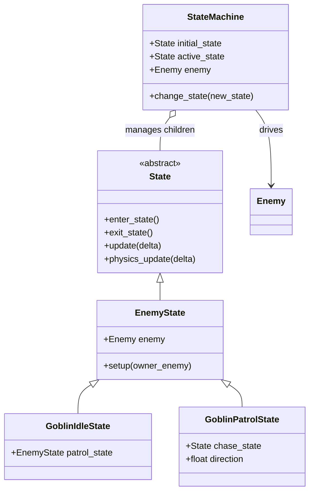

# NES Shooter (working title)

A 2D action prototype built in Godot. The focus so far has been on building solid player
movement and enemy systems, not on visuals, which are intentionally not a priority yet.
The diagrams used are made in mermaid.ai

## Tech stack

Godot Engine, GDScript

## Controls (current)

- Move left / right
- Jump (with air jump)
- Dash (with a short invincibility window)
- Hold down to fast-fall / descend faster
- Attack (single shot) / Charge attack (3-bullet spread)

## Player Movement — Modular Components

Player movement is handled through modular components rather than one large script. The
`Player` class acts as a middleman for each component: it calls the engine's physics functions
every frame, which lets each component read input and act independently. Splitting the logic
this way keeps the project easier to scale and read.

Every component is exported to the inspector under the `Nodes` category.

**Note on component access**<br>
Every component connects through `Player`, which also means every component technically has
access to every other component's variables and functions through that shared `Player`
instance (e.g. calling `GravityComponent` logic from inside `JumpComponent`). **Avoid doing
this** — the instance referenced this way can be stale, and in the worst case it risks a
recursive loop if you're not careful.

## Architecture Diagram

```mermaid
classDiagram
    class CharacterBody2D

    class Player {
        +float facing_direction
        +take_damage(amount)
    }
    class Enemy {
        +float move_speed
        +float damage
        +take_damage(amount)
        +can_see_player() bool
        +is_in_attack_range() bool
    }
    class Goblin {
        +float patrol_direction
    }
    CharacterBody2D <|-- Player
    CharacterBody2D <|-- Enemy
    Enemy <|-- Goblin
    Enemy ..> Player : detects (group lookup)

    class HealthComponent {
        +float max_health
        +float health
        +bool is_dead
        +take_damage(amount)
        +heal(amount)
    }

    class GravityComponent {
        +float gravity
        +bool is_falling
        +handle_gravity(body, delta, is_descending)
    }
    class PlayerGravityComponent {
        +float descend_multiplier
    }
    class EnemyGravityComponent {
        +float testGr
    }
    GravityComponent <|-- PlayerGravityComponent
    GravityComponent <|-- EnemyGravityComponent

    class MovementComponent {
        +handle_horizontal_movement(body, direction)
    }
    class PlayerMovementComponent {
        +float move_speed
    }
    class EnemyMovementComponent {
        +float move_speed
    }
    MovementComponent <|-- PlayerMovementComponent
    MovementComponent <|-- EnemyMovementComponent

    class JumpComponent {
        +handle_jump(body, want_to_jump)
    }
    class PlayerJumpComponent {
        +float jump_velocity
        +float air_jump_multiplier
        +bool is_jumping
        +bool has_air_jumped
    }
    JumpComponent <|-- PlayerJumpComponent

    class AnimationComponent {
        +Sprite2D sprite
        +AnimationPlayer animation_player
        +play_animation(name)
        +handle_horizontal_flip(direction)
        +flip_towards_position(owner, target)
    }
    class PlayerAnimationComponent {
        +update_animation(player, move_direction)
    }
    class EnemyAnimationComponent {
        +play_idle()
        +play_walk()
        +play_attack()
        +play_hurt()
        +play_death()
    }
    AnimationComponent <|-- PlayerAnimationComponent
    AnimationComponent <|-- EnemyAnimationComponent

    class InputComponent {
        +float input_horizontal
        +bool jump_pressed
        +bool jump_held
        +bool dash_pressed
        +bool holding_down
        +update_input()
    }

    class PlayerDashComponent {
        +float dash_duration
        +float dash_speed
        +float dash_cooldown
        +bool is_dashing
        +handle_dash(body, wants_to_dash, delta)
        +start_dash(body)
    }

    Player *-- HealthComponent
    Player *-- PlayerGravityComponent
    Player *-- InputComponent
    Player *-- PlayerMovementComponent
    Player *-- PlayerAnimationComponent
    Player *-- PlayerJumpComponent
    Player *-- PlayerDashComponent

    Enemy *-- HealthComponent
    Enemy *-- EnemyGravityComponent
    Enemy *-- EnemyMovementComponent
    Enemy *-- EnemyAnimationComponent

    class ProgressBar
    class HealthBar {
        +Timer timer
        +ProgressBar damage_bar
        +HealthComponent health_component
        +float current_health
        +init_health(health, max_health)
    }
    class PlayerHealthBar
    class DashBar {
        +float dash_duration
        +float dash_value
        +init_dash_bar(duration, max)
    }
    ProgressBar <|-- HealthBar
    ProgressBar <|-- DashBar
    HealthBar <|-- PlayerHealthBar
    HealthBar ..> HealthComponent : listens (health_changed, died)

    class Gun {
        +Vector2 direction
    }
    class Projectile {
        +float SPEED
        +float damage_amount
    }
    Gun ..> Projectile : spawns
    Projectile ..> Player : take_damage()
    Projectile ..> Enemy : take_damage()
```



_Note: `Player`/`Enemy` declare their component slots using the base types (e.g.
`GravityComponent`), but the inspector actually assigns the `Player*`/`Enemy*` subclass —
that's what makes the same `Player`/`Enemy` script work with different concrete behavior per
component._

## Components

### 1. InputComponent

Handles user input through a single `update_input()` function, setting booleans based on
whether the corresponding action is pressed:

```gdscript
input_horizontal = Input.get_axis("left", "right")
jump_pressed = Input.is_action_just_pressed("jump")
jump_held = Input.is_action_pressed("jump")
dash_pressed = Input.is_action_just_pressed("dash")
holding_down = Input.is_action_pressed("down")
```

These booleans are passed directly to the other components that need them.

### 2. GravityComponent

Applies gravity by checking whether the body is on the floor and adding the appropriate
velocity. Gravity strength is a constant defined in `GameConstant`. The player variant
(`PlayerGravityComponent`) adds a `descend_multiplier` for faster falling while holding down;
the enemy variant currently just overrides the gravity value for tuning.

### 3. MovementComponent

Handles horizontal movement through `handle_horizontal_movement()`, using the passed direction
parameter to set the character's velocity. The base class is empty on purpose — `Player` and
`Enemy` each use their own subclass (`PlayerMovementComponent`, `EnemyMovementComponent`) with
their own speed and rules (e.g. enemies stop accelerating into walls).

### 4. JumpComponent

Handles regular and air jumps using an air-jump multiplier and the `want_to_jump` boolean.
Only `Player` uses a real implementation (`PlayerJumpComponent`) — enemies don't jump, so
`Enemy` simply doesn't have a jump component at all.

### 5. DashComponent

Dash uses a timer for the cooldown plus simple float values for duration and speed, both
adjustable from the inspector on the dash node. Dashing also grants a short invincibility
window that lets the player pass through enemies.

The dash checks which direction the character is facing, accelerates them in that direction,
then starts the cooldown timer and invincibility window:

```gdscript
body.set_collision_layer_value(PLAYER_LAYER, false)
body.set_collision_layer_value(INVINCIBLE_LAYER, true)
body.set_collision_mask_value(ENEMY_LAYER, false)
```

The same logic is reversed once the invincibility window ends. Dash is player-only — there's
no `DashComponent` base class, just one concrete `PlayerDashComponent`.

### 6. AnimationComponent

Requires an `AnimationPlayer` and `Sprite2D` node assigned via the exported variables. Plays
animations and handles character flipping. `PlayerAnimationComponent` derives the right
animation (idle/walk/jump/fall) from movement and gravity state; `EnemyAnimationComponent`
instead exposes simple named actions (`play_idle()`, `play_walk()`, `play_attack()`, etc.) that
enemy states call directly.

**Possible improvement**<br>
Right now `PlayerAnimationComponent` checks things like `player.is_on_floor()` directly instead
of relying on booleans from the other components. Adding something like an `is_moving`
variable to `MovementComponent` and reading that instead of raw input would be cleaner — though
that line of thinking pulls me right back toward a state machine, which is exactly what I was
trying to avoid for the player.

## Enemy AI — State Machine

Enemies use a state machine instead of the modular component approach used for the player.
Each `Enemy` (e.g. `Goblin`) owns a `StateMachine` node, which manages a set of `State` children
and switches between them based on signals.

- `State` is the base class: defines `enter_state()`, `exit_state()`, `update()`, and
  `physics_update()`, meant to be overridden per state.
- `StateMachine` tracks an `active_state`, calls `update()`/`physics_update()` on it every
  frame, and switches state whenever a child emits `switch_state`.
- `EnemyState` extends `State` and gives every enemy state a reference back to its owning
  `Enemy`.
- `GoblinIdleState` switches to `GoblinPatrolState` when it can't see the player.
  `GoblinPatrolState` walks back and forth (reversing on hitting a wall) and is wired to switch
  to a `chase_state` when it spots the player — but that chase state doesn't exist yet, so
  right now patrol never actually leaves patrol.



## Weapons

- `Gun` aims at the mouse position every frame and spawns `Projectile` instances on attack —
  either a single shot, or a 3-bullet spread (-15°/0°/+15°) on charge attack.
- `Projectile` moves forward at a fixed speed and calls `take_damage()` on whatever it hits, as
  long as that body implements `take_damage()`. That's how the same projectile can damage both
  `Player` and `Enemy` without needing to know which one it hit.

## Devlog / Design Notes

I've gone through a few different approaches while building this:

1. Started with rough, "scuffed" movement since I didn't know anything about game architecture yet.
2. Learned about state machines and rebuilt movement around them. Got a lot of features working, but logic and important variables ended up spread across many different states, which became hard to maintain.
3. Rebuilt the state machine, then changed direction again partway through and moved to a modular component approach instead.
4. In hindsight, I leaned too hard into stuffing everything into states during the state-machine version — the functionality could have been split up better than it was.

State machines genuinely seem better suited for movement than the modular approach turned out
to be, so the current plan is: state machines for enemies, and keep the simpler component
setup for the player for as long as it holds up. This might turn out to be the wrong call, but
it's the current direction lol.
